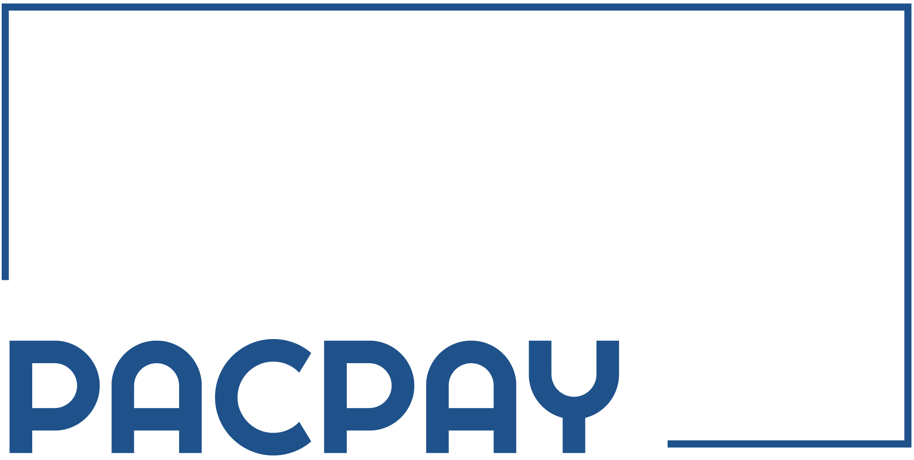

# Credit Card Validator

## Índice

* [1. Introducción](#1-introducción)
* [2. Imagen final del proyecto](#2-imagen-final-del-proyecto)
* [3. Investigación UX](#3-investigación-UX)
* [4. Conclusión](#4-conclusión)

***

## 1. Introducción

Nuestro proyecto consiste en validar números de tarjetas de créditos a través de el
algoritmo de Luhn, para esto creamos un sitio de pagos online llamado PacPay.

   

## 2. Imagen final del proyecto

  
  
  
  

## 3. Investigación UX
 
  1. Los usuarios y los objetivos en relación con el producto.
    Esta aplicación web está dirigida para aquellos usuarios que utilicen plataformas de pago online y que preferentemente usen tarjetas de crédito como método de pago. También está dirigida para los usuarios que busquen una plataforma de pago segura y confiable.

  2. Cómo el producto soluciona las necesidades de los usuarios.
    En nuestro sitio web se podrán realizar pagos de forma remota y desde la comodidad del hogar, oficina, restaurantes etc., lo que permitirá ahorrar valioso tiempo, el cual hoy en día es muy necesario para el ajetreado estilo de vida que se lleva .

  3. Imagen del primer prototipo en papel.

  
  

  4. Resumen del feedback.
    Inicialmente, al terminar nuestro sketching en InVision, le solicitamos a las integrantes del squad 3 su feedback. Hicimos los cambios pertinentes, en lo que respecta a los colores del fondo de la página y la posición de los botones. Una vez terminados estos cambios, le enviamos este sketch a Allison (coach de UX) para solicitar su retroalimentación. Nos sugirió agregar un botón "Volver" para poder darle una interacción más "user friendly" a la página. Cambios que incorporamos al proyecto.
 
  5. Imagen del prototipo final.

  
  
  
  
  
## 4. Conclusión
    Como se puede apreciar en este readme, todo el proceso de diseño de la aplicación y su producto final han resultado muy diferentes. A pesar de lo anterior, logramos terminar con una página funcional y que cumple con los objetivos planteados. Sin embargo, como autocrítica constructiva sentimos que tenemos pendiente incorporar atributos que encontramos faltantes. Como por ejemplo, colocar en el input de tipo texto el "required" con Javascript, mejorar el estilo de la página con CSS y hacerlo responsive.
